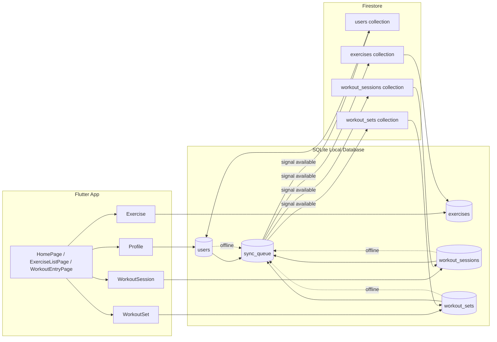

# gym_android

A new Flutter project.

## Getting Started

This project is a starting point for a Flutter application.

A few resources to get you started if this is your first Flutter project:

- [Learn Flutter](https://docs.flutter.dev/get-started/learn-flutter)
- [Write your first Flutter app](https://docs.flutter.dev/get-started/codelab)
- [Flutter learning resources](https://docs.flutter.dev/reference/learning-resources)

For help getting started with Flutter development, view the
[online documentation](https://docs.flutter.dev/), which offers tutorials,
samples, guidance on mobile development, and a full API reference.

## Local-first data flow and backup architecture

This project is designed around a local-first pattern: workout data is saved locally first, and then uploaded to a remote database when the device has internet access.



### Data model mapping

- `Profile` maps to `users` in SQLite and `users` in Firestore
- `Exercise` maps to `exercises`
- `WorkoutSession` maps to `workout_sessions`
- `WorkoutSet` maps to `workout_sets`
- `sync_queue` stores items waiting for upload while offline

### Current state of the codebase

At this stage, the app is still using mock repositories and mock data files rather than a real SQLite database or Firestore integration.

Relevant files:

- `lib/mock_data/profiles.dart`
- `lib/mock_data/exercises.dart`
- `lib/mock_data/workout_sessions.dart`
- `lib/repositories/mock/mock_profile_repository.dart`
- `lib/repositories/mock/mock_exercise_repository.dart`
- `lib/repositories/mock/mock_session_repository.dart`
- `lib/repositories/mock/mock_set_repository.dart`

The long-term design is:

1. Save changes locally in SQLite immediately
2. Add the change to `sync_queue` if offline
3. When signal returns, upload queued records to Firestore
4. Mark them as synced and clear them from the queue

## Project structure

```text
lib/
  main.dart
  models/
  mock_data/
  pages/
  repositories/
  widgets/
```
